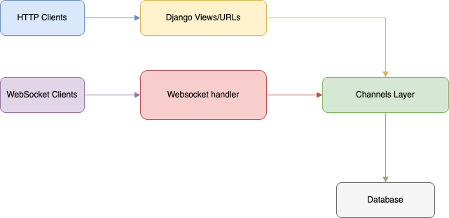
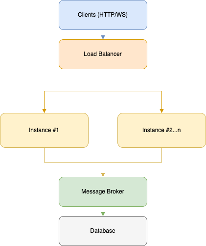
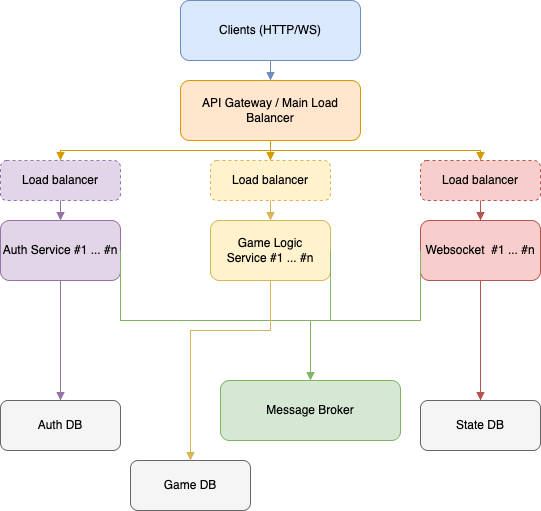

# Kasagi Backend

Scalable Real-time State Synchronization Service

---

### Components

- **WebSocket Consumer**: Handles client connections and message broadcasting
- **Channels Layer**: Manages communication between server instances
- **ASGI Server**: Daphne for handling async connections
- **State Manager**: Tracks and reconciles game/application state

---

## Architecture

### Monolith vs Distributed vs Microservice

**Monolith (Current implementation)**

This prototype is implemented in Django as a monolith for rapid prototyping. However, the architecture is designed with future scalability in mind. As the system grows, it can be enhanced into one of the following:

**Distributed Monolith**

- The Django app can be horizontally scaled by running multiple instances and handled by load balancer.
- Channels layer like Redis enables real-time message passing between instances.
- Stateless design allows for easy scaling and failover.

**Microservices**

- Different components can be grouped and split into separate services.
- Each service can be independently deployed, scaled, and maintained.
- Communication between services can use REST, gRPC, or message queues.

**Trade-offs**

- Monolith: Easy to build and maintain, but will be expensive to scale especially when the player base increases exponentially.
- Distributed: Scales better than monolith, while needing the expertise of efficiently managing the distributed services.
- Microservices: Services can be isolated and does not fail fully if any of the service is out of order. It is expensive and requires long time to implement, not worthy especially when the user base is small.

---

**Diagrams**

- Monolith Architecture:
  

---
- Distributed Architecture:
  

---
- Microservices Architecture:
  

---

## Discussion / Justification

### Communication Protocol

- `Websocket` is selected because it has lesser overhead than simple polling due to the persistent bidirectional connections.
- Supported by most if not all browsers.
- Low latency.

### Data Serialization

- `JSON` is used in this prototype as it is simple and universal.
- For future enhancement, after the system has evolved into a microservice architecture, it can actually adopt rpc and thus communicate with each other using `protobuff`. While it is harder to debug, it has smaller size therefore more efficient communicating with each other.

### Performance Enhancement

- Track previous state for each client.
- Send only changed delta/ properties rather than complete state.
- Client-side reconstruction of full state.
- Configurable full-state sync frequency to prevent drift.

### Horizontal Scaling

- A message broker (such as Redis, RabbitMQ, or Kafka) enables multiple server instances to communicate and broadcast state updates in real time. These systems provide pub/sub or streaming capabilities, allowing messages like state updates to be efficiently distributed to relevant services.
- Session/room based sharding can be implemented to distribute load across different server. This ensures that no server meets bottleneck, and that state updates are efficiently routed to only the relevant clients.
- Stateless design allows for easy container orchestration and scaling; no local state nor sticky sessions therefore any server can handle any client that is trying to connect.

### Potential Bottlenecks

- Excessive DB read/write might happen and needs read replicas or master /slave model to overcome this problem.
- Message broker might be overloaded and needs to be scaled (either horizontal/vertical) as well.
- High amount of client connections will put a heavy toll on the server. Load balancers are needed to redirect the connections across multiple instance

---

## Resilience & Fault Tolerance

### Connection Management

- Heartbeat mechanism can be used to detect when clients disconnect unexpectedly, allowing the server to promptly clean up resources and notify other users.
- When a client reconnects, a reconnection protocol with state reconciliation ensures the client receives the latest state and can resume with the correct state.
- Session persistence across reconnections helps maintain user experience, so users do not lose their session or progress if they have packet loss.

### Data Consistency

- The server acts as the single source of truth for all state changes, so even if clients try to send conflicting or out-of-order updates (or even tampered updates), the server always decides what is valid. This also helps prevent tampering or cheating from the client side (assuming the server is robust and not easily compromised).
- ~~The above has to be managed properly to prevent ending up like Ubisoft's potato server :P~~.
- Every state update is tagged with a version or sequence number. This way, if there are latency that causes messages to be received out of order, the server and clients can still apply them in the correct order and avoid ruining the game.
- All state changes are handled as atomic transactions, so either the entire update is applied or nothing is changed. This prevents the system from ending up in a weird or broken state if something goes wrong halfway through an update.

### Server Failure Recovery

- State should be regularly copied (replicated) across multiple server instances. If one server goes down, another can quickly take over with the latest data, so users don’t lose progress.
- If something breaks, the system can be designed to keep running in a limited way instead of crashing completely. This way, the users connected might be lagged for a short while, but the service stays online.
- The latest state is saved to persistent storage (like Redis with disk persistence, or Kafka where the messages are persisted), so even if all servers crash, the system can reload the most recent state and recover quickly after a restart.

### Current Trade-offs

- **Simplicity vs. Efficiency:** The system uses JSON for data serialization, which is easy to debug and widely supported, but less efficient than binary protocols like protobuf. This makes development and troubleshooting easier, but may impact performance at scale.
- **Global broadcasting vs. Selective updates:** All state updates are currently broadcast to all connected client. This can cause unneeded network traffic and processing, especially as the number of clients grows. Targeted updates should be implemented in the full implementation as per the requirements at that time, and to increase the efficiency.
- **Single server vs. Distributed architecture:** The prototype runs as a single server for simplicity, but this limits scalability and fault tolerance. This can evolves into microservices or distributed architecture depending on the need.
- **In-memory state vs. Persistent state:** All state is currently held in memory, so it is lost if the server restarts or crashes. This is perfectly fine for a prototype but persisted storage will be needed - for consistency, failure recovery, etc.

## Testing Plan

### Performance Testing

- Stress test the services by simulating a large numbers of clients using tools like Locust to generate load and see how the system performs under stress.
- Measure the message throughput, latency or spike to simulate the real world scenario are met, and to identify any slowdowns when the load increases.
- Implement analytic to gather system metrics and logs to pinpoint bottlenecks, such as slow database queries or message broker delays; from there, targeted optimisation can be done.

### Scalability Testing

- Deploy multiple server instances to ensure that the system can scale horizontally and handle increased traffic.
- Gradually increase the number of concurrent connections to determine the maximum capacity before performance is affected.
- Evaluate the performance of the message broker or queue (Redis, RabbitMQ, Kafka) under high load, to ensure that it can keep up with the volume of state updates and broadcasts.

### Reliability Testing

- Test how the system responds to client disconnection and reconnection, and make sure that states are properly restored and no data is lost in the process.
- Simulate server shutdowns and restarts to confirm that recovery is smooth and clients experience minimal disruption.
- Introduce network issues (latency, packet loss, temporary outages, etc.) to see how the system handles real-world network instability, and to ensure robust error handling and reconnection logic are in place.

## Final Verdict
TBD
